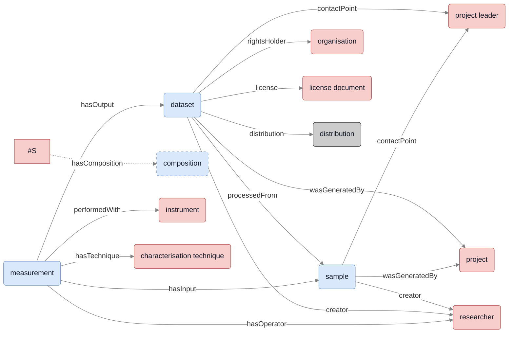

# Graph Explorer
A web application for exploring a knowledge graph.

Initially this webapp will be demonstrated in the domain of physical metallurgy.

The figure below shows how each experimental dataset in the knowledge graph is defined and how it relates to other resources.

**Figure** The interrelations between the `sample`, `dataset` and `measurement` (blue boxes) and their relation to shared resources (red boxes).
Accessibility is provided via the dataset `distribution` (gray box), which is a blank node exposing a dcat:downloadURL or dcat:accessURL.
Literals relations are not shown for brevity.
